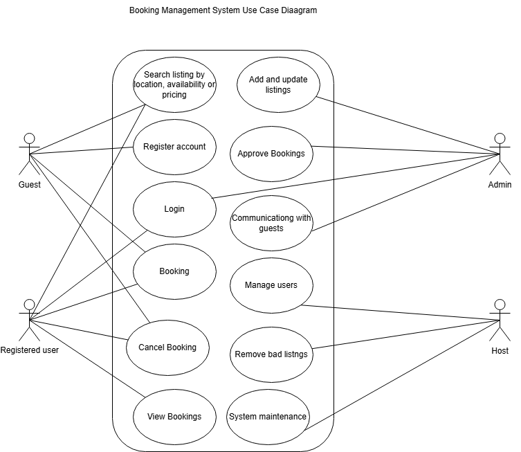

# Requirement Analysis in Software Development  
The project focuses on crafting a comprehensive foundation for software development by documenting, analyzing, and structuring requirements. It involves creating a well-defined blueprint for the requirement analysis phase of a booking management system. The project emulates a real-world scenario, emphasizing clarity, precision, and structuring, setting the stage for successful project execution.

---

## What is Requirement Analysis?  
Requirement Analysis is an essential step in the software development process. It’s where the project team gathers, analyzes, and defines exactly what the software should do and how it should perform. Think of it as setting the blueprint for the entire project to ensure everyone is on the same page.

- This process ensures that all stakeholders have a clear understanding of what the system should do and how it should perform.

---

## Why is Requirement Analysis Important?  
Here’s why Requirement Analysis is critical in any software development lifecycle (SDLC):  
- **Clarity and Focus:** Clearly defining what stakeholders need avoids misunderstandings, ensuring each stakeholder is on the same page. Stakeholders can also focus on their roles in developing the system.  
- **Defining Scope:** Keeps the project on track by setting boundaries, so there’s no unexpected scope creep.  
- **Solid Foundation:** Provides a clear starting point for design and development.  
- **Better Estimates:** Helps in figuring out how much time, money, and resources the project will need.  
- **Customer Satisfaction:** Ensures the final product meets expectations, leading to happy users.

---

## Key Activities in Requirement Analysis  
These are the main steps involved in Requirement Analysis:

1. **Requirement Gathering:**  
   - Conduct interviews with stakeholders.  
   - Use surveys or questionnaires for wider input.  
   - Organize workshops to brainstorm and clarify ideas.  
   - Observe how users currently work.  
   - Review existing documents and systems for insights.

2. **Requirement Elicitation:**  
   - Host brainstorming sessions to gather ideas.  
   - Form focus groups to dive deeper into specific requirements.  
   - Build prototypes to visualize and refine requirements.

3. **Requirement Documentation:**
   - Write a detailed specification document. 
   - Create user stories that describe what each feature should do from the user's perspective.  
   - Use diagrams to explain system interactions.

4. **Requirement Analysis and Modeling:**  
   - Prioritize requirements based on importance.  
   - Check if each requirement is technically and financially feasible.  
   - Use diagrams like data flows or ERDs to map out the system.

5. **Requirement Validation:**  
   - Review requirements with stakeholders to confirm everything’s accurate.  
   - Define clear acceptance criteria to make sure the requirements are met.  
   - Track requirements to ensure they’re implemented properly.

---

## Types of Requirements

### Functional Requirements
These describe what the system should do.  

**Examples for the Booking System:**  
- Allow users to search for properties by location, price, and availability.  
- Enable user registration and login securely.  
- Show property listings with essential details and images.  
- Let users book properties and manage their bookings.

### Non-functional Requirements  
These describe how the system should perform.  

**Examples for the Booking System:**  
- **Performance:** Pages should load in less than 2 seconds.  
- **Security:** Ensure user data is encrypted and login is secure.  
- **Scalability:** Handle up to 1000 concurrent users.  
- **Usability:** The interface should be simple and easy to use.  
- **Reliability:** Maintain 99.9% uptime and quick recovery from failures.

---

## Use Case Diagrams  

### What Are Use Case Diagrams?  
Use case diagrams show how users (actors) interact with a system to achieve specific goals (use cases).  

**Benefits:**  
- Makes system functionalities easy to understand.  
- Helps organize and clarify requirements.  
- Improves communication between stakeholders and developers.

### Example: Booking System Use Case Diagram  
Here’s a visual representation of how the booking system will work:  

  

---

## Acceptance Criteria  
Acceptance criteria define the standards a feature must meet to be considered complete.  

**Why is this important?**  
- Ensures everyone knows what "done" looks like.  
- Provides a basis for testing and validation.  
- Improves product quality and user satisfaction.  

**Example for Checkout Feature:**  
- Users can select available dates.  
- Users confirm their booking.  
- A confirmation email is sent within 2 minutes.  

---

